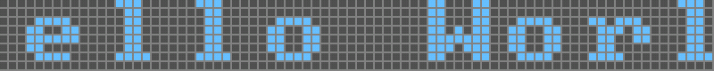

# LED sign board

## Build & Usage

```sh
$ git clone https://github.com/epicmet/LED-sign-board

$ cd LED-sign-board && make -B

$ ./build/ledsb -help
Usage: ./ledsb [OPTIONS] [--] [ARGS]
OPTIONS:
    -render-gif
        Render gif out of screen recording
    -help
        Print help
    -text <str>
        Text to render
        Default:   EMPTY
```

## Preview

```sh
./build/ledsb -text 'Hello World!' -render-gif
```

